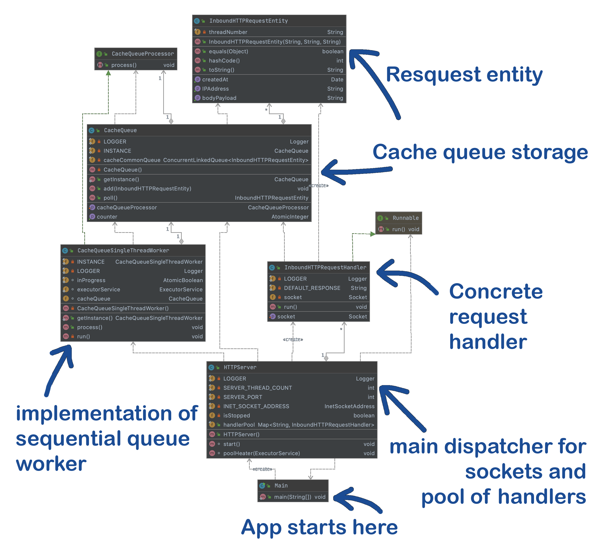

# Malta Proxy

### :bulb: &nbsp; Idea

Simple caching proxy server based on Java with zero dependencies

### :ballot_box_with_check: Features

- Support the HTTP 1.1
- Based on Java Sockets
- Thread pool of handlers
- Non-blocking thread-safe cache queue

### :gear: &nbsp; Components
* Java 15 `Tested with OpenJDK 15`
* Gradle 6.3

## Performance 

JMeter test config file: [MaltaProxy_JMeter_performance_test.jmx](MaltaProxy_JMeter_performance_test.jmx)

[CSV test data with the request body samples ( ~ 47 bytes per request )](MaltaProxyCannedJsonDeviceData10k.csv)
 for performance test measurement in [JMeter](https://jmeter.apache.org/) or whatever tool you would use.
The format is 1 JSON row per 1 request, 10k rows overall.
  
Run JMeter test in command line with specifying the log file with results:   
```
jmeter -t MaltaProxy_JMeter_performance_test.jmx -n -l jMeterDetailedResults.csv
```  
  
To update settings or run JMeter in GUI run `jmeter` in command line, open the [MaltaProxy_JMeter_performance_test.jmx](MaltaProxy_JMeter_performance_test.jmx), change the options and save it.
  
***Due to the performance of Java Sockets, the avg result I got was the ~ 400 requests / sec*** 

***Utilization of heap memory was under 25Mb all the time of test (Using the ZGC)***
  
## How to build

```
./gradlew build
```
  
## How to run

Simple run:

```
java -jar /project_root/build/libs/MaltaProxy-0.9.jar SERVER_PORT=8081 THREADS=4 
```

With ZGC and echo to the log file:
  
```
java -XX:+UseZGC -Xms128m -Xmx256m -XX:+UseLargePages -XX:ConcGCThreads=4 -jar /project_root/build/libs/MaltaProxy-0.9.jar SERVER_PORT=8081 THREADS=4 > /log_directory/detailed.log 2>&1
```
  
## Class diagram



## Support

If you need any kind of support don't hesitate to let me know :wink:
  
Created by [Alex Antukhov](https://www.linkedin.com/in/antukhov/) 
